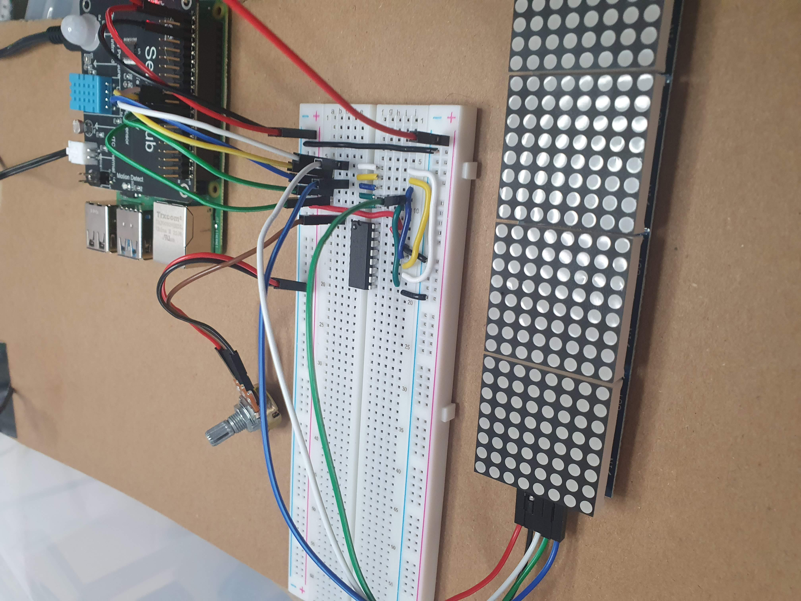

# www.theswamp.co.uk

Personal website code

A [Blazor WebAssembly](https://docs.microsoft.com/aspnet/core/blazor/?view=aspnetcore-3.1#blazor-webassembly) client application, a C# [Azure Functions](https://docs.microsoft.com/azure/azure-functions/functions-overview) and a C# class library with shared code.

Here's what the backend looks like as of 01/Oct/2021, It's a Raspberry PI 4B, with a Sensor Hub HAT plugged into a breadboard.

### Sensor Hub 

On the I2C bus, all in one unit that provides various temperature/humidity sensors

### 8x8x4 LED matrix

### MCP3008 ADC

The R-PI doesn't have any analogue pins, and a lot of what I have planned (various sensors) are all analogue so we need something to convert it. The MCP3008 sits on the Raspberry PI's SPI bus and gives me 8 analogue channels.

